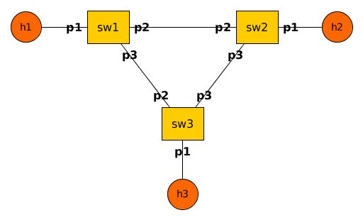

# Assignment 2

In this assignment, you will use P4 and Mininet to design network features.

## Outline

- [Introduction](#introduction)
- [Obtaining required software](#obtaining-required-software)
- [Before starting the exercises](#before-starting-the-exercises)
- [Exercise 1: Source Routing](#exercise-1-source-routing)
  - [Description of the EasyRoute protocol](#description-of-the-easyroute-protocol)
  - [A few hints](#a-few-hints)
  - [Populating the tables](#populating-the-tables)
  - [Testing your code](#testing-your-code)
  - [Debugging your code](#debugging-your-code)
- [Exercise 2: Key-Value Store](#exercise-2-key-value-store)
  - [What is key-value store](#what-is-key-value-store)
  - [What you need to do](#what-you-need-to-do)

## Deliverables

Submit your source code for the two exercises, in two separate folders `exercise1` and `exercise2`, and together in one 
`assignment2.zip` file. Please provide a `README.txt` file for each exercise in their corresponding folder descibing any 
specific instructions needed to run your code. We will run your code exactly in the `assignment2_src` directory of this 
course repository (as described in the **NOTE** in the exercise 1 part below) with only the files you provided adding to 
the right place or replacing the original files there, so please make sure to submit **all** and **only** the code files 
you generated or modified and make sure they work well in the right place. (You do not need to submit `env.sh` file even 
if you modified it.)

You will get full points if your code could be run successfully and generate required performance. If your code cannot 
be run or doesn't have the right performance, we will first deduct half of the total points then look at your code to 
assign partial credit (meaning that you will not get more than half of the credit).


## Introduction

This assignment includes 2 exercises: *Source Routing*
and *Key-Value Store*. Both exercises assume that you possess basic networking
knowledge and some familiarity with the P4 language. Please take a look at the
[P4 language spec](http://p4.org/spec/) and at the example `simple_router`
target [on
p4lang](https://github.com/p4lang/p4factory/tree/master/targets/simple_router/p4src).
*Source Routing* asks you to write a P4 program to implement a
custom source routing protocol. *Key-Value Store* asks you to write a P4 program to implement a key-value store in the switch. We use P4_14 in this assignment.


## Obtaining required software

To complete the exercises, you will need to clone 2 p4lang Github repositories
and install their dependencies. To clonde the repositories:

- `git clone https://github.com/p4lang/behavioral-model.git bmv2`
- `git clone https://github.com/p4lang/p4c-bm.git p4c-bmv2`

The first repository ([bmv2](https://github.com/p4lang/behavioral-model)) is the
second version of the behavioral model. It is a C++ software switch that will
behave according to your P4 program. The second repository
([p4c-bmv2](https://github.com/p4lang/p4c-bm)) is the compiler for the
behavioral model: it takes P4 program and output a JSON file which can be loaded
by the behavioral model.

Each of these repositories come with dependencies. `p4c-bmv2` is a Python
repository and installing the required Python dependencies is very easy to do
using `pip`: `sudo pip install -r requirements.txt`.

`bmv2` is a C++ repository and has more external dependencies. They are listed
in the
[README](https://github.com/p4lang/behavioral-model/blob/master/README.md). If
you are running Ubuntu 14.04+, the dependencies should be easy to install (you
can use the `install_deps.sh` script that comes with `bmv2`). Do not forget to
build the code once all the dependencies have been installed:

- `./autogen.sh`
- `./configure`
- `make`

You will also need to install `mininet`, as well as the following Python
packages: `scapy`, `thrift` (>= 0.9.2) and `networkx`. On Ubuntu, it would look
like this:
- `sudo apt-get install mininet`
- `sudo pip install scapy thrift networkx`

**NOTE FOR MAC USERS**: OS X currently doesn't support native Mininet installation. You 
would need to do this assignment in a virtual ubuntu environment. The easiest way would 
probably be through running a pre-packaged Mininet/Ubuntu VM in VirtualBox, please read 
carefully and follow through the instructions in [here](http://mininet.org/download/). 
For later running `xterm` to open terminal on hosts, you probably need to install 
[XQuartz](https://www.xquartz.org).

[//]: # (## Before starting the exercises)

[//]: # (Update the values of the shell variables `BMV2_PATH` and
[//]: # (`P4C_BM_PATH` in the `env.sh` file. Note that if you cloned both repositories in the same directory as)
[//]: # (this one, you will not need to change the value of the variables.)

[//]: # (That's all :)

## Exercise 1: Source Routing

Place yourself in the `assignment2_src` directory [here](https://github.com/xinjin/course-adv-net/tree/master/assignments/assignment2_src).

**NOTE**: Please do 
`git clone https://github.com/xinjin/course-adv-net.git`
to get a copy of the whole course repository then work in the assignment directory noted above, 
or the script `run_demo.sh` would probably fail to source some files when you try running it.

In this problem, we will implement a very simple source routing protocol in
P4. We will call this protocol EasyRoute. You will be designing the P4 program
from scratch. To test your implementation, a Mininet network needs to be 
established to allow messages being sent between hosts, which is already implemented 
and provided for you by topo.py. 

Your job is 
1. implementing the parser and the ingress control flow in the provided 
skeleton program:
[../assignment2_src/p4src/source_routing.p4](https://github.com/xinjin/course-adv-net/blob/master/assignments/assignment2_src/p4src/source_routing.p4);
2. filling the `commands.txt` file with necessary commands.

(You probably need to modify the sourcing path in script `course-adv-net/assignments/env.sh` 
to let it successfully find the directory it wants in your local environment.)


### Description of the EasyRoute protocol

The EasyRoute packets looks like this:

```
preamble (8 bytes) | num_valid (4 bytes) | port_1 (1 byte) | port_2 (1 byte) |
... | port_n (1 byte) | payload
```

The preamble is always set to 0. You can use this to distinguish the EasyRoute
packets from other packets (Ethernet frames) your switch may receive. We do not
guarantee that your P4 switch will exclusively receive EasyRoute packets.

The num_valid field indicates the number of valid ports in the header. If your
EasyRoute packet is to traverse 3 switches, num_valid will initially be set to
3, and the port list will be 3 byte long. When a switch receives an EasyRoute
packet, the first port of the list is used to determine the outgoing port for
the packet. num_valid is then decremented by 1 and the first port is removed
from the list.

We will use the EasyRoute protocol to send text messages. The payload will
therefore correspond to the text message we are sending. You do not have to
worry about the encoding of the text message.



If I wish to send message "Hello" from h1 to h3, the EasyRoute packet will look
like this:

- when it leaves h1:
`00000000 00000000 | 00000002 | 03 | 01 | Hello`

- when it leaves sw1:
`00000000 00000000 | 00000001 | 01 | Hello`

- when it leaves sw3:
`00000000 00000000 | 00000000 | Hello`

Note that the last switch should not remove the EasyRoute header; otherwise the
application running in the end hosts won’t be able to handle incoming packets
properly.

Your P4 implementation needs to adhere to the following requirements:

1. **all non-EasyRoute packets should be dropped**
2. **if a switch receives an EasyRoute packet for which num_valid is 0, the
packet should be dropped**

### A few hints

1. in the start parse state, you can use `current()` to check if the packet is
an EasyRoute packet. A call to `current(0, 64)` will examine the first 64 bits
of the packet, **without shifting the packet pointer**.
2. do not forget that a table can match on the validity of a header. Furthermore
if a header is not valid, our software switch will set all its fields to 0.
3. a table can "match" on an empty key, which means the default action will
always be executed - if configured correctly by the runtime. Just omit the
"reads" attribute to achieve this.
4. you can remove a header with a call to `remove_header()`
5. when parsing the EasyRoute header, you do not have to parse the whole port
list. Actually P4 is currently missing language constructs needed to parse a
general Type-Length-Value style header<sup>[1](#myfootnote1)</sup>, and hence
you’ll need to simply extract the first port of the list and ignore the rest
(including the payload). Also preamble, num_valid and the port number don't have
to all be placed in the same header type.
6. finally, we advise you to put all your logic in the ingress control flow and
leave the egress empty. You will not need more than 1 or 2 tables to implement
EasyRoute.

<a name="myfootnote1">1</a>: Members of [P4.org](http://p4.org) are working
together to come up with language constructs needed to be able to parse
TLV-style headers soon.

### Populating the tables

Once your P4 code is ready (you can validate it easily by running `p4-validate`
on it), you need to think about populating the tables. We made it easy for you:
you just have to fill the commands.txt file with `bmv2` CLI commands. We think
that you only need to know 2 commands:

- `table_set_default <table_name> <action_name> [action_data]`: this is used to
set the default action of a given table
- `table_add <table_name> <action_name> <match_fields> => [action_data]`: this
is used to add an entry to a table

### Testing your code

./run_demo.sh will compile your code and create the Mininet network described
above. It will also use commands.txt to configure each one of the switches.
Once the network is up and running, you should type the following in the Mininet
CLI:

- `xterm h1`
- `xterm h3`

This will open a terminal for you on h1 and h3.

On h3 run: `./receive.py`.

On h1 run: `./send.py h1 h3`.

You should then be able to type messages on h1 and receive them on h3. The
`send.py` program finds the shortest path between h1 and h3 using Dijkstra, then
send correctly-formatted packets to h3 through s1 and s3.

### Debugging your code

.pcap files will be generated for every interface (9 files: 3 for each of the 3
switches). You can look at the appropriate files and check that your packets are
being processed correctly.

## Exercise 2: Key-Value Store

### What is key-value store

A key-value store is a storage service. Each item in the key-value store has a key, which is the name of the item, and a value, which is the actual content of the item. A key-value store provides two basic funcions: `get(key)` and `put(key, value)`. The function `get(key)` gets the value of the corresponding key from the key-value store. The function `put(key, value)` updates the value of the corresoponding in the key-value store.

### What you need to do

You will implement a key-value store in the switch with P4. The key-value packets may look like this:
```
preamble (8 bytes) | num_valid (4 bytes) | port (1 byte) | type (1 byte) 
| key (4 bytes) | value (4 bytes)
```

The preamble is always set to 1. You can use this to distinguish the key-value
packets from other packets (EasyRoute packets and Ethernet frames) your switch may receive. We do not
guarantee that your P4 switch will exclusively receive EasyRoute packets.

The type field indicates the type of the query, which can be 0 (get request), 1 (put request), 2 (get reply), and 3 (put reply). The key and value field contains the key and value of a item, respectively.

For a `get` query, the type field should be 0 and the key field contains the key for the queried item. The value field is not meaningful. The switch should update the type field to 2, and update the value field based on the value stored in the switch. Then the switch sends the packet back to the sender as the reply.

For a `put` query, the type field should be 1, the key field should contain the key for the queried item, and the value field should contain the new value of the item. The switch should update its key-value store with the new value, update the type field to 3, and then send the packet back to the sender as the reply.

To make it simple, you do not need to implement sohpisicated routing in this assignment. You can assume that the client is directly connect to the switch, and the switch simply sends the packet to the ingress port to reply to the client.

You can use part of the code in EasyRoute and implement the key-value store functionality. Set the size of the key-value store in the switch to be 1000. You need to modify the kv.py in order to implement a simple client that can issue get and put queries to the switch.

### Performance requirement

1. Do not modify the topology used in exercise 1. Run the key-value store process on host 1 and switch 1.
2. Open a terminal on host 1 with `xterm h1` and run `./kv.py`, you should be able to issue the `get` and `put` query with commands `put [key] [value]` and `get [key]`, for example `put 1 11` and `get 1`.
3. You should receive reply messages from switch 1 on host 1 and display the type, key and value fields in each reply 
message.

### Hints

1. You could just implement kv.py with a modified version of send.py.
2. You could open a second terminal on h1 and run an adjusted recieve.py to receive and display reply messages.
3. You can assume the key and value are both integers, and use key as the array index to access register.

